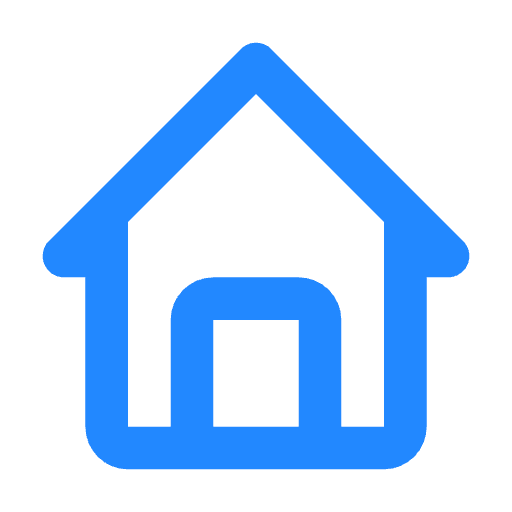

<div align="center">
  <div class="logo-container">
    
  </div>
  
  <!-- Animated Background Styling -->
  
  > ### Premium Real Estate Platform
  
  [](https://reactjs.org/)
  [](https://nodejs.org/)
  [](https://www.mongodb.com/)
  [](https://tailwindcss.com/)
  [](https://www.framer.com/motion/)
  
  <a href="https://gstate.vercel.app" target="_blank"></a>
  <a href="#%EF%B8%8F-installation"></a>
  <a href="https://github.com/99Gssabek/gstate/issues/new"></a>
  <a href="#-contributing"></a>
</div>

<div align="center">
  
</div>

<br>

<div align="center">
  
</div>

## ✨ Key Features

<table>
  <tr>
    <td>
      <h3>🏠 User Experience</h3>
      <ul>
        <li>Advanced property search with multiple filters</li>
        <li>Virtual property tours with image galleries</li>
        <li>Secure user authentication system</li>
        <li>Interactive appointment scheduling</li>
        <li>Favorites system with smart lists</li>
        <li>Fully responsive across all devices</li>
      </ul>
    </td>
    <td width="50%">
      
    </td>
  </tr>

  <tr>
    <td>
      <h3>👩‍💼 Admin Dashboard</h3>
      <ul>
        <li>Comprehensive analytics and reporting</li>
        <li>Property management with bulk operations</li>
        <li>Appointment tracking and management</li>
        <li>User activity monitoring</li>
        <li>Content management system</li>
        <li>Sales performance metrics</li>
      </ul>
    </td>
    <td>
      
    </td>
  </tr>
</table>

<details>
  <br>

  <p>GState features expertly crafted animations that enhance the user experience:</p>

  <ul>
    <li><strong>Page Transitions:</strong> Smooth fade and slide transitions between routes</li>
    <li><strong>UI Micro-interactions:</strong> Subtle feedback animations for all user actions</li>
    <li><strong>Content Reveal:</strong> Staggered animations for list items and content sections</li>
    <li><strong>Data Visualization:</strong> Progressive chart animations with interactive tooltips</li>
    <li><strong>Image Galleries:</strong> Fluid carousels with zoom capabilities</li>
    <li><strong>Loading States:</strong> Attractive loading skeletons and transitions</li>
  </ul>

  <p>All animations are performance-optimized using Framer Motion's best practices for smooth experiences on all devices.</p>
</details>

## 🛠️ Technology Stack

<div align="center">

### Frontend


### Backend


### DevOps & Deployment


</div>

## 📋 Project Overview

GState is a modern real estate platform that combines traditional property listing features. The platform helps users find their ideal properties while providing valuable investment insights through machine learning algorithms.

The application consists of three main parts:
- **Frontend:** User-facing website with property listings
- **Admin Dashboard:** Comprehensive management interface for properties and users
- **Backend API:** Robust Express server 

Key differentiators include real-time market analysis, and investment opportunity identification, all presented with fluid animations for an exceptional user experience.

## 🚀 Getting Started

### System Requirements

- **Node.js**: v16.0.0 or higher
- **npm** or **yarn**: Latest stable version
- **MongoDB**: v4.4 or higher (local or Atlas)
- **API Keys**: Azure AI, FirecrawlJS, OpenAI (optional)
- **Storage**: At least 500MB free disk space

### ⚙️ Installation

<details>
<summary><b>Step 1: Clone the repository</b></summary>

```bash
git clone https://github.com/99Gssabek/gstate.git
cd Real-Estate-Website
```
</details>

<details>
<summary><b>Step 2: Environment configuration</b></summary>

Create the following environment files with these required variables:

**Backend (.env)**
```env
PORT=4000
MONGODB_URI=your_mongodb_connection_string
JWT_SECRET=your_jwt_secret
EMAIL=your_email_for_notifications
PASSWORD=your_email_password
AZURE_API_KEY=your_azure_ai_key
FIRECRAWL_API_KEY=your_firecrawl_api_key
NODE_ENV=development
IMAGEKIT_PUBLIC_KEY=your_imagekit_public_key
IMAGEKIT_PRIVATE_KEY=your_imagekit_private_key
IMAGEKIT_URL_ENDPOINT=your_imagekit_url
```

**Frontend (.env.local)**
```env
VITE_API_BASE_URL=http://localhost:4000
```

**Admin (.env.local)**
```env
VITE_BACKEND_URL=http://localhost:4000
```

</details>

<details>
<summary><b>Step 3: Install dependencies</b></summary>

```bash
# Install all dependencies with a single command
npm run setup

# Or install each package separately
cd backend && npm install
cd ../frontend && npm install
cd ../admin && npm install
```
</details>

<details>
<summary><b>Step 4: Start development servers</b></summary>

```bash
# Start all services concurrently
npm run dev

# Or start each service separately
cd backend && npm run dev
cd frontend && npm run dev
cd admin && npm run dev
```

This will launch:
- 🌐 **Frontend**: http://localhost:5173
- 👩‍💼 **Admin Panel**: http://localhost:5174
- ⚙️ **Backend API**: http://localhost:4000
</details>

<details>
<summary><b>Step 5: Docker deployment (optional)</b></summary>

For containerized deployment:

```bash
# Build and start all containers
docker-compose up --build

# Or run just the backend
docker-compose up backend
```

Default ports will be mapped to host machine:
- Backend API: http://localhost:4000
- Frontend: http://localhost:3000
- Admin Panel: http://localhost:3001
</details>

<details>
<summary><b>💾 Database setup</b></summary>

The application will automatically set up the MongoDB collections on first run. 

For local development with sample data:
```bash
# Import sample data (from project root)
cd backend
npm run seed
```

This will populate your database with sample properties, users, and appointments.
</details>

<details>
<summary><b>🔑 Default admin credentials</b></summary>

After running the seed script, you can log in to the admin panel with:

- **Email:** admin@gstate.com
- **Password:** admin123
</details>

## 🧩 Application Structure

```
project/
├── admin/                 # Admin dashboard React app
│   ├── src/
│   │   ├── components/    # Reusable UI components
│   │   ├── contexts/      # Auth and data contexts
│   │   ├── pages/         # Admin dashboard pages
│   │   └── services/      # API service layer
│   └── public/            # Static assets
│
├── backend/               # Express server and API
│   ├── config/            # Server configuration
│   ├── controller/        # Request handlers
│   ├── middleware/        # Express middleware
│   ├── models/            # Mongoose schemas
│   ├── routes/            # API routes
│   ├── services/          # External service integrations
│   └── utils/             # Helper utilities
│
└── frontend/              # User-facing React app
    ├── src/
    │   ├── assets/        # Images and static resources
    │   ├── components/    # UI components
    │   ├── context/       # Application state management
    │   ├── pages/         # Page components
    │   ├── services/      # API client services
    │   └── utils/         # Helper utilities
    └── public/            # Static assets
```

## 📊 Feature Highlights

<div align="center">
  <!-- Animated Stats Section -->
  <div>
    
    
    
  </div>
  <br>
</div>

### Property Search & Discovery

GState offers a sophisticated property search system with multiple filtering options:

- **Location-based search** with map integration
- **Price range filters** with dynamic market comparison
- **Property type categorization** (apartments, houses, villas, etc.)
- **Amenity-based filtering** with 15+ property features
- **Saved search preferences** for registered users


All data visualizations feature smooth animations and interactive elements for better understanding.

### User Account Management

The platform offers comprehensive user account features:

- **Secure authentication** with JWT and refresh tokens
- **Profile customization** with saved preferences
- **Favorite properties** with smart categorization
- **Viewing appointment scheduling** and management
- **Email notifications** for account activities and property updates
- **Newsletter subscription** for market updates (opt-in)

## 💌 Newsletter Management

GState includes a newsletter system for property updates and market trends:

- **Subscription management** via user profile
- **Email preference center** for customizing update frequency
- **One-click unsubscribe** option in all emails
- **GDPR compliant** data storage and processing

> 💡 **Note about privacy:** All user data is stored securely and used only for the purposes explicitly stated in our privacy policy. Users can request data deletion at any time.

## 🛠️ Troubleshooting

<details>
<summary><b>Common Issues & Solutions</b></summary>

### Connection Issues
- **MongoDB Connection Fails**: Check your connection string in .env file and ensure your IP is whitelisted in MongoDB Atlas
- **API Endpoints Returning 404**: Verify the VITE_API_BASE_URL in frontend and admin .env files

### Authentication Problems
- **Admin Login Fails**: Try resetting the admin password using the backend utility:
  ```bash
  cd backend
  npm run reset-admin-password
  ```
- **JWT Token Errors**: Ensure the JWT_SECRET is identical on all deployment environments

### Image Upload Issues
- **Images Not Uploading**: Check ImageKit credentials and connectivity
- **File Size Errors**: Reduce image size to under 5MB

## 🖥️ Screenshots

<table>
  <tr>
    <td></td>
    <td></td>
  </tr>
  <tr>
    <td></td>
    <td></td>
  </tr>
</table>

<br>

<div align="center">
  
</div>


Please read our [Contributing Guidelines](CONTRIBUTING.md) for more details.

### Code Style Standards

- We use ESLint and Prettier for code formatting
- Component-based architecture for UI elements
- Jest for unit testing
- Documentation required for all new features

## 📝 License

This project is licensed under the MIT License - see the [LICENSE](LICENSE) file for details.

## 🌟 Acknowledgements

<div align="center">
  
[](https://reactjs.org/)
[](https://expressjs.com/)
[](https://www.mongodb.com/)
[](https://tailwindcss.com/)
[](https://www.framer.com/motion/)
[](https://lucide.dev/)
  
</div>

Special thanks to all contributors and the open source community.

## 📧 Contact & Support

<div align="center">

  <a href="mailto:ghassan.ssh123@hotmaıl.com"></a>
</div>

<br>

<div align="center">
  
  <p>Built with ❤️ by MHD GHASSAN AL SABEK</p>
  <p>© 2025 GState. All Rights Reserved.</p>
</div>
